# Skemi

| # |Table of Contents|
|---|-----------------|
| [1](https://github.com/NatalieLouise91/T3A2-Skemi-FrontEnd#part-a-documentation) | Part A Documentation|
| [2](https://github.com/NatalieLouise91/T3A2-Skemi-FrontEnd#purpose) | Purpose |
| [3](https://github.com/NatalieLouise91/T3A2-Skemi-FrontEnd#functionality-and-features) | Functionality & Features |
| [4](https://github.com/NatalieLouise91/T3A2-Skemi-FrontEnd#target-audience) | Target Audience |
| [5](https://github.com/NatalieLouise91/T3A2-Skemi-FrontEnd#tech-stack) | Proposed Tech Stack |
| [6](https://github.com/NatalieLouise91/T3A2-Skemi-FrontEnd#architecture-diagram) | Architecture Diagram |
| [7](https://github.com/NatalieLouise91/T3A2-Skemi-FrontEnd#dataflow-diagram) | Dataflow Diagram |
| [8](https://github.com/NatalieLouise91/T3A2-Skemi-FrontEnd#user-stories) | User Stories |
| [9](https://github.com/NatalieLouise91/T3A2-Skemi-FrontEnd#wireframes) | Wireframes |
| [10](https://github.com/NatalieLouise91/T3A2-Skemi-FrontEnd#part-b-documentation) | Part B Documentation |
| [11](https://github.com/NatalieLouise91/T3A2-Skemi-FrontEnd#repositories-and-deployed-website) | App Links |
| [12](https://github.com/NatalieLouise91/T3A2-Skemi-FrontEnd#final-tech-stack) | Final Tech Stack |
| [13](https://github.com/NatalieLouise91/T3A2-Skemi-FrontEnd#project-management) | Project Management |
| [14](https://github.com/NatalieLouise91/T3A2-Skemi-FrontEnd#testing) | Testing |
 

# Part A Documentation

## Purpose

Skemi (pronounced ske-mi) is an event planning and scheduling app built for a sydney based company that plans and services approximately 200 events a year. These events require meticulous organisation and as the business scales, current planning and scheduling processes have become outdated, slow, and unreliable.

The purpose of this app is to streamline the event planning process for Shared Affair by replacing the current procedure and tools in place; they currently use google calendar, excel spreadsheets and direct communication. The app will allow admins to easily create and roster events as well as provide a streamlined method for employees to track upcoming events, allow employees to self register for work, provide relevant event information including other rostered employees, food lists and custom notes, and provide a way to easily track upcoming work schedules.

Although there are existing systems and software like Deputy, foundU and Kronos that handle employee scheduling, these systems are built around immutable variables that make it difficult for event planning and catering businesses to use. As it stands, most rostering tools allow an admin user to create a roster based on a consistent location (this may be the entire business or an area of the business like the “Kitchen” at a cafe).

While a business can set different locations, the information associated to the location does not allow for changes or updates and lacks the functionality to create a significant number of “locations”. In addition, these systems do not allow a location to be created with associated document uploads, notes, or specific information and because of this lacking functionality they do not meet the needs of Shared Affair who are looking for a solution that allows them to plan and schedule out hundreds of events and rosters and share the information with it’s employees.

## Functionality and Features

### Account Authentication

- Secure account creation
- Authentication through third party API
- Simple log in/out (saving secure account data)
- Admin and standard user permissions
- Password and account recovery

### Event record creation

Create a record for an event that logs and tracks time, location details and rostered employees. 

### Event record interaction (non-admin users)

Users can interact with all created events including relevant details and information.  

- Users can schedule themselves to work an event

**Design amendment** 

It was decided that users should only be able to view the shifts that they were allocated. This functionality change aimed to create a fairer environment, in which employees would be granted equal hours across events. 

### Event record interaction (Admin users)

- Admin users can update event details and information
- Admin users can delete an event
- Admin users can update an event roster
- Admin users can delete shifts and rosters

### UI

- Users (admin and standard) can interact with a navigation bar and page links
- Users are notified when an action is completed on event records (pop up confirmations)
- Users can view future scheduled events
- Users can view their scheduled events

## Target Audience

Given this app is being created to solve a specific problem within a Sydney based events and catering business called Shared Affair, the target audience are the managers and employees within the business.

Specific target audience personas are portrayed in the app by implementing features for the different job roles and responsibilities of users including features and functionality for managers (admins in the system) or general employees (users in the system). These two groups of users make up the target audience and are being considered throughout the planning and build process.

## Tech Stack

#### React.js

React.js will be used to build the user interface. While React.js is a requirement of this assignment, we’re also choosing to use this JavaScript library because of its simple component based infrastructure and available methods to easily manage UI state, rendering and re-rendering.

#### Rails

We have chosen to use Rails for the backend CRUD operations and routes as it uses the MVC architecture allowing for a straight forward implementation and integration of the back end as well as it’s simple integration to React through either web packer and the react-rails gem, or using the Rails API.

#### Postgresql

Postgresql will be used for the database as it is a powerful, open source object-relational database system with a strong reputation and has been used by all team members in previous projects.

#### Material UI

MUI started back in 2014, to unify React and Material Design and offers a complete styling library for react.

## Architecture Diagram

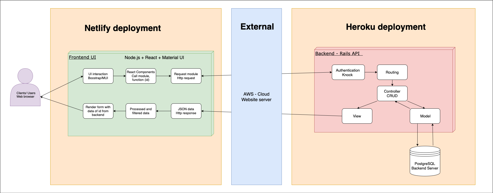

## Dataflow Diagram

### Standard User DFD

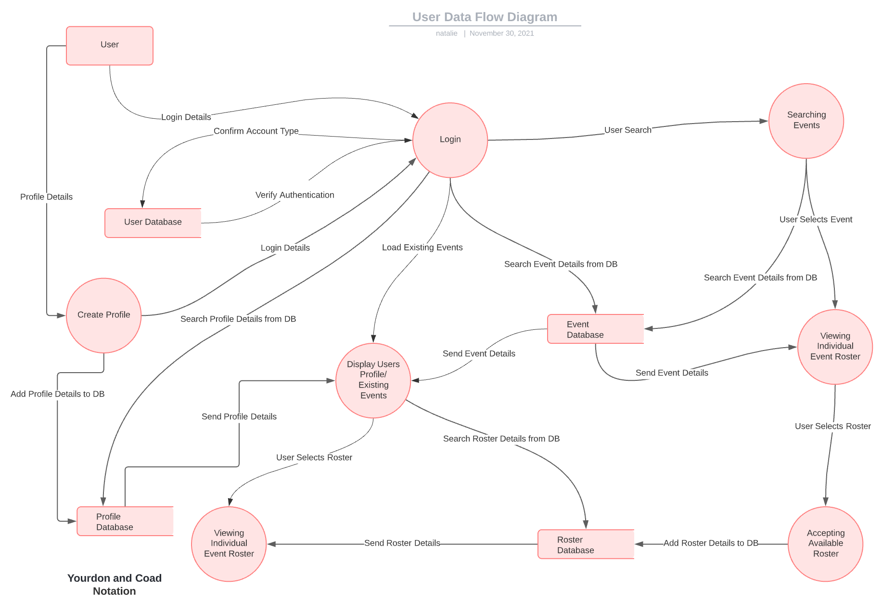

### Admin User DFD - Create and Read Features

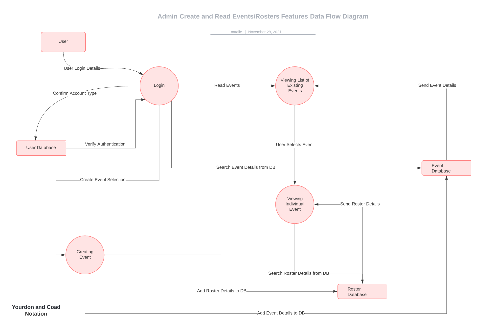

### Admin User DFD - Search and Update Features

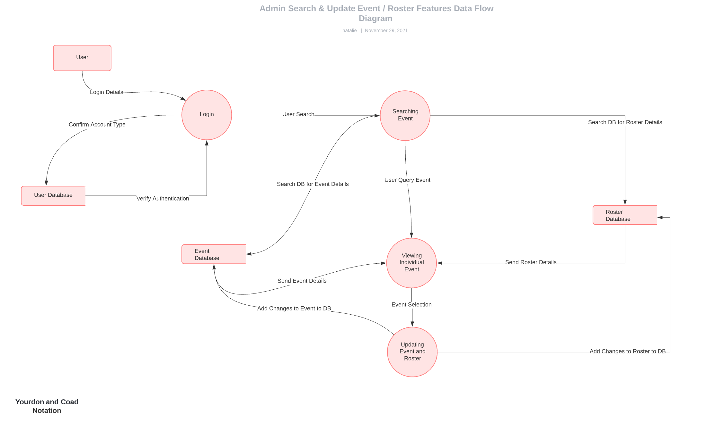

## User Stories

#### As an admin user I want to be able to create a record for an upcoming event so that I can track relevant information

-  As an admin user I want to be able to schedule an event so that I can track relevant event information and schedule employees to work
-  As an admin user I want to have the option to update an event so that changes can be made to the event information
-  As an admin user I want to be able to delete an event so that everyone is aware if an event is cancelled
-  As an admin user I want to assign employees to work an event so that I can proactively fill shifts with available employees
-  As an admin user I want to be able to update a roster so that I can make changes if circumstances change and someone can no longer work an event
-  As an admin user I want to receive a confirmation every time a change is made to an event or roster

#### As a user I want a secure way to sign up for the app so I can access all app features and return to my saved information

-  As a user I want a secure way to create an account so that I can access all of the features in the app
-  As a user I want to log in and out of the app so that I can save my secure information
-  As a user I want to be able to sign up as a standard user or an admin user

#### As a user I want to create a personal profile so that I can see my rostered events

-  As a user I want to create a profile page with a profile picture so that others can see who they are working with at the event
-  As a user I want to add personal contact information so that others in the business can contact me

***Bonus features after MVP: -**
-  As a user I want to add my job role to my personal profile so that others can see my job role
-  As a user I want to be able to update information so that I can keep information updated if it changes
-  As a user I want to be able to update my profile picture so that it stays current

#### As a user I want to see created events so that I can view event related information

-  As a user I want to see when an event is scheduled including the name, location, date and time and contact information for client.
-  As a user I want to see how many job roles are listed at the event

***Bonus features after MVP: -**
- As a user I want to be able to view what job roles are needed for the event so that I can roster myself to work

#### As a user I want to be able to register for an event so that I can work

-  As a user I want to view all of the events I am registered to work
-  As a user I want to see others that are working the event so that I can see who I am working with
-  As a user I want to see the event details so that I can make an informed decision about working the event

***Bonus features after MVP: -**

-  As a user I want to be able to register my self for a shift so that I can work at an event
-  As a user I want to get a confirmation that I am signed up to an event so that I can be sure the request went through

#### As a user I want to view my work schedule so that I can see what events I am working

-  As a user I want to be able to view the upcoming events I am rostered/scheduled to work so that I never miss a work day
-  As a user I want to see event information so that I know where and when the event is scheduled
-  As a user I want to see who is working at an event so that I can work with people I know

***Bonus features after MVP: -**

-  As a user I want to see what jobs are available at an event so that I can know if there's a position vacant for a job role that suits me

#### As a user I want the website to be easy to navigate so that I'm not confused with any processes

-  As a user I want to interact with easy to use links so that I can easily navigate the website
-  As a user I want a website that is visually appealing so that I'm motivated to return and use it again
-  As a user I want process confirmations so that I know when something has been selected or completed

# Wireframes

## User Registration Desktop, Tablet & Mobile

**Note:** - the first user created for the application is the default administration user and will have administrative permissions. All other users after are defaulted to standard users. 

## Standard User Mobile Wireframes

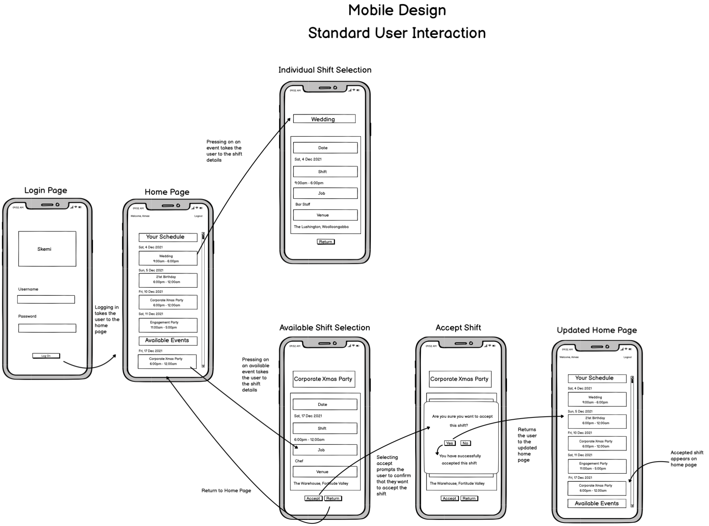

## Standard User Tablet Wireframes

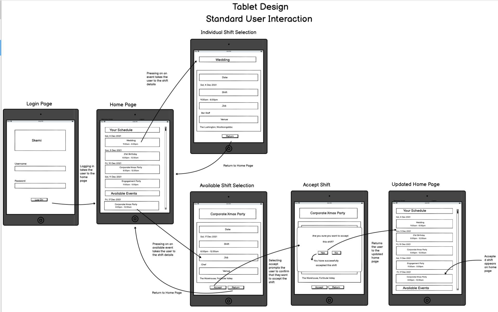

## Standard User Desktop Wireframes

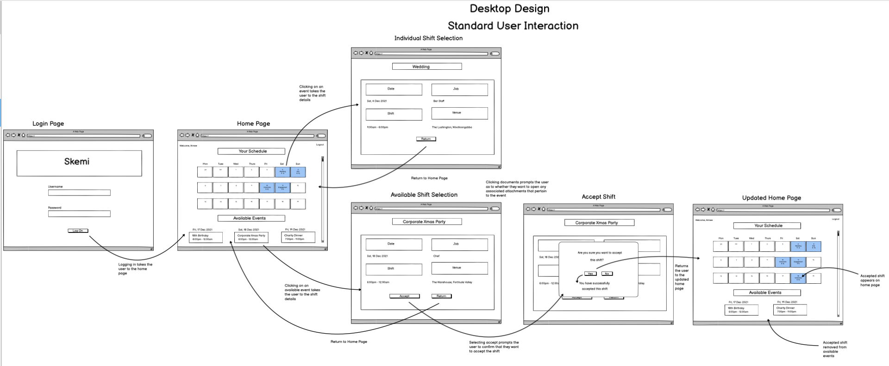

## Admin User Mobile Wireframes: Read & Delete Events

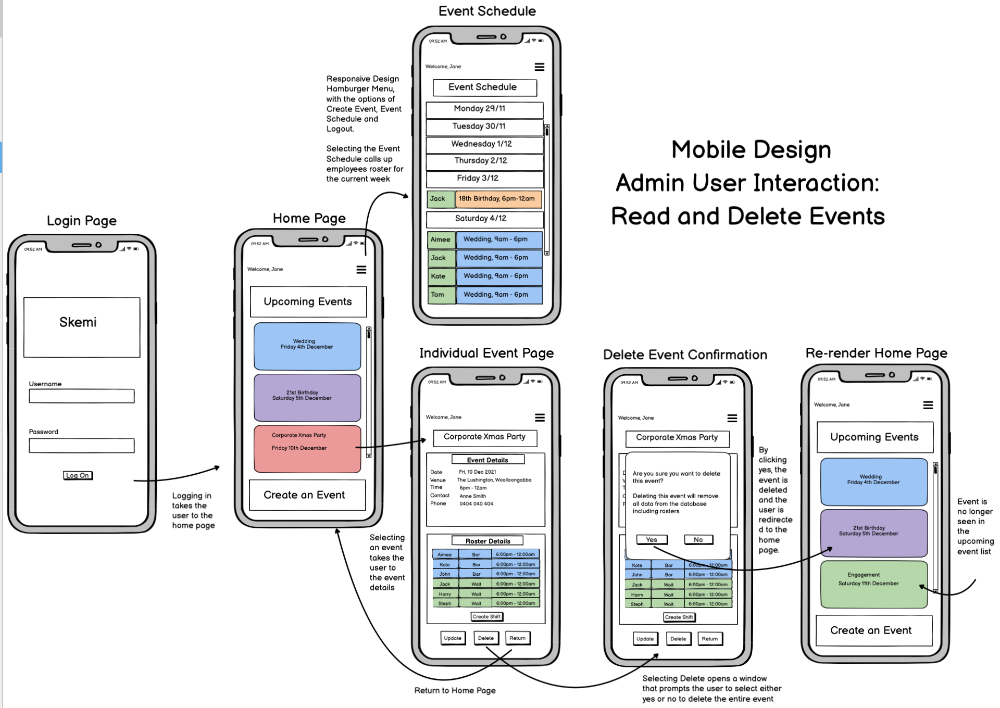

## Admin User Mobile Wireframes: Create & Update Events Rosters

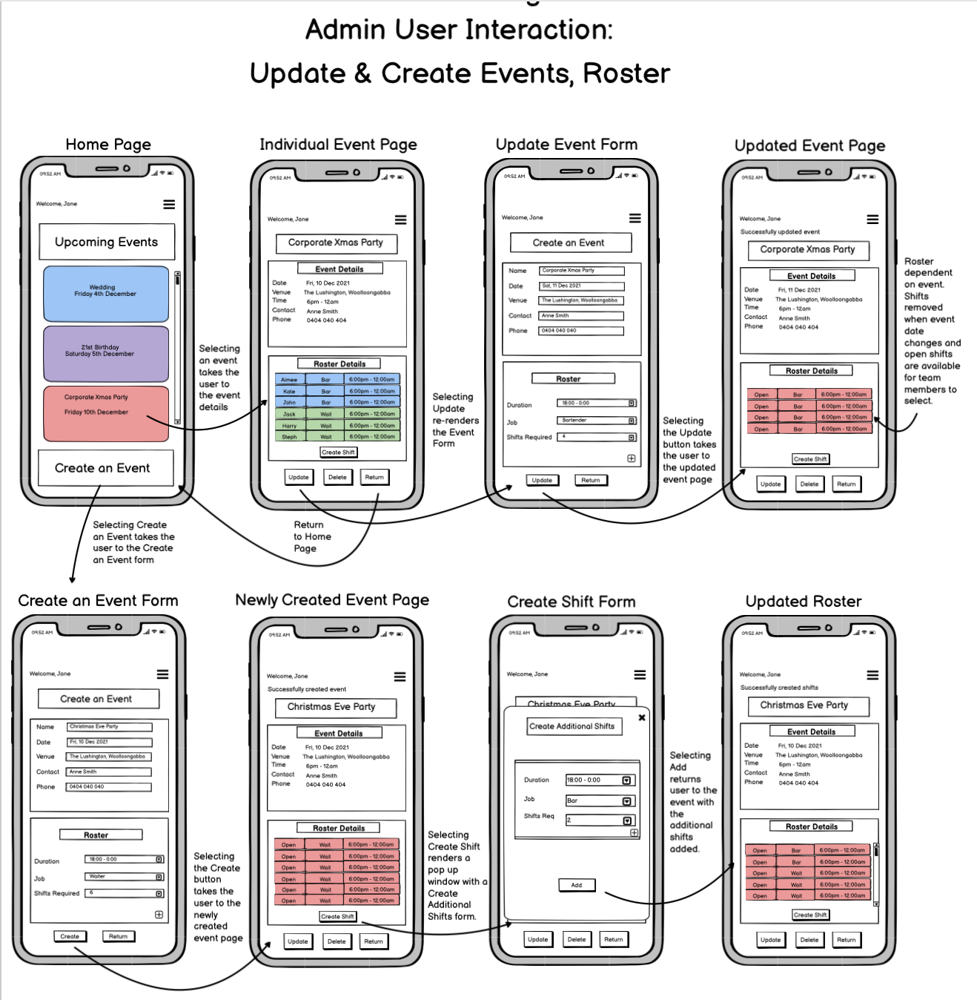

## Admin User Mobile Wireframes: Delete Individual Shifts

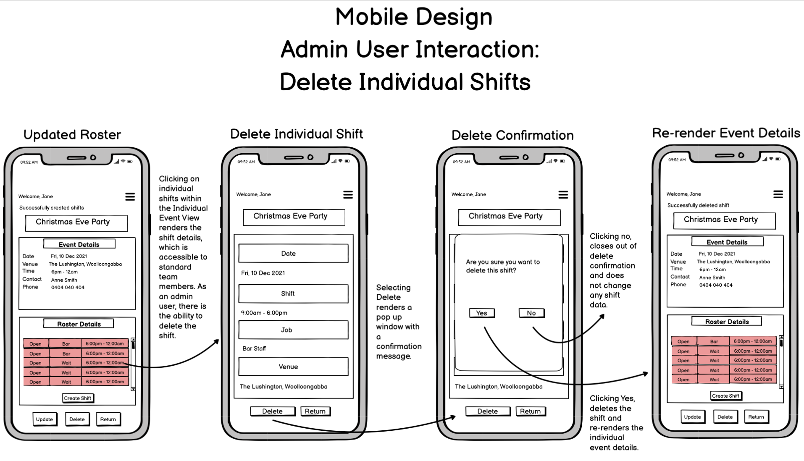

## Admin User Tablet Wireframes: Read & Delete Events

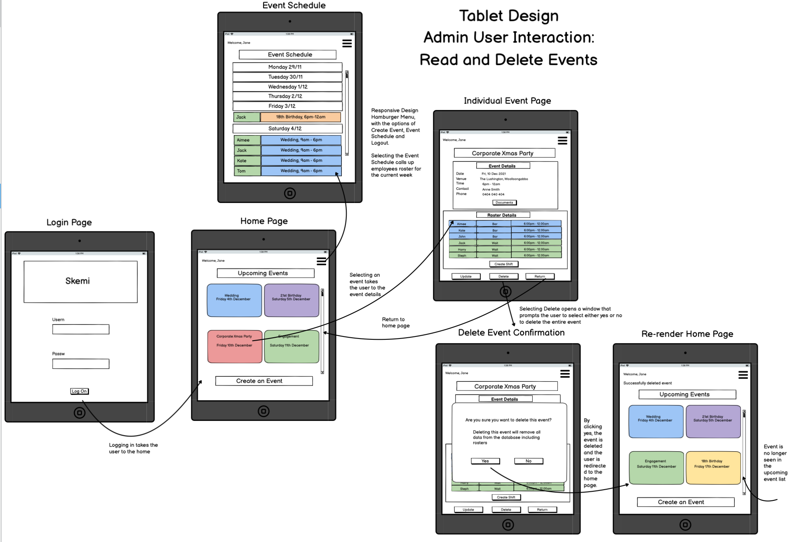

## Admin User Tablet Wireframes: Create & Update Events Rosters

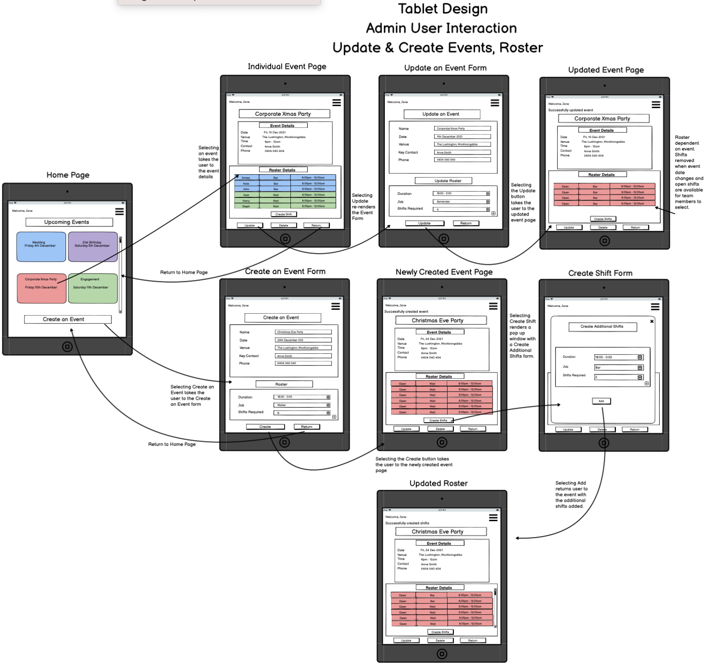

## Admin User Tablet Wireframes: Delete Individual Shifts

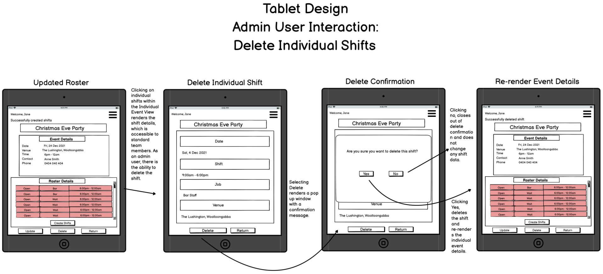

## Admin User Desktop Wireframes: Read & Delete Events

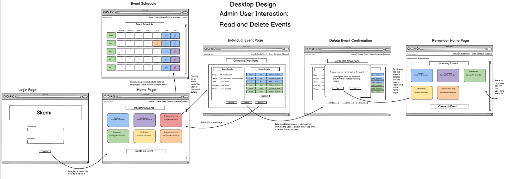

## Admin User Desktop Wireframes: Create & Update Events Rosters

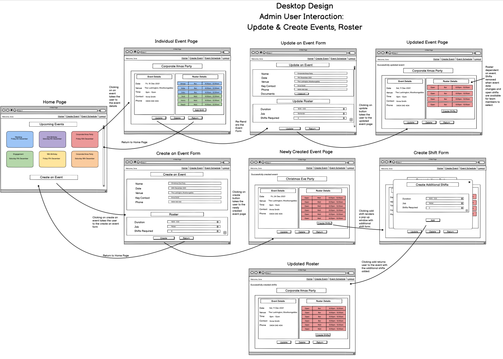

## Admin User Desktop Wireframes: Delete Individual Shifts

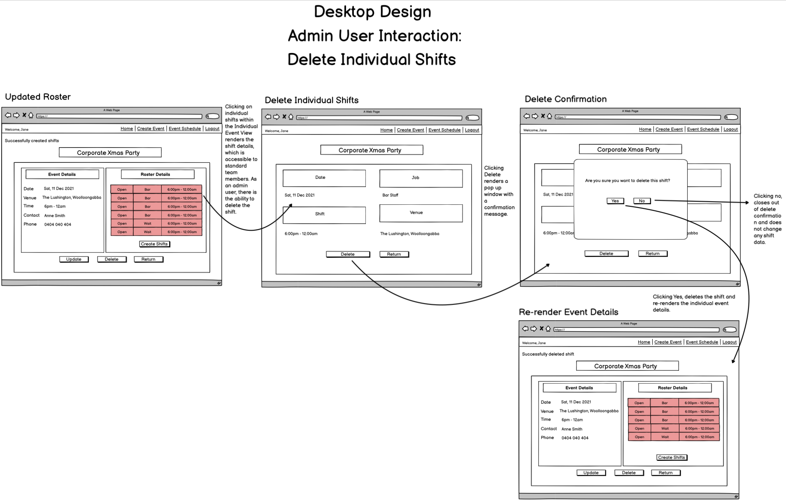

# Part B Documentation

## Repositories and Deployed Website

Front-end GitHub Repository:

[Skemi-Client](https://github.com/NatalieLouise91/T3A2-Skemi-FrontEnd)

Back-end GitHub Repository:

[Skemi-API](https://github.com/NatalieLouise91/T3A2-Rails-BackEnd)

Deployed Application:

[Skemi](https://skemi.netlify.app/)

## Final Tech Stack

### Frontend

**HTML/JSX:**
JSX was utilised to write HTML in each React component. This provided the basic structure of the content within each React component. 

**JavaScript:**
JavaScript was used to write the logic required in each component. 

**ReactJS:**
The ReactJS library was utilised to create Skemi as a single-page application. The implementation of ReactJS in the application also allowed for reusable UI components.

**Material UI:** 
The application was predominately styled using material ui components. This allowed us to build a minimalist and responsive user interface. 

**iType:** 
The npm package iType was utilised to add animated text to loading screens. 

**Axios:**
Axios was used as an alternative to Fetch. It is a library that has the ability to create HTTP requests externally. This allowed the Skemi React Client to communicate with the Skemi Rails API. 

### Backend

**Knock:**
Knock provided JSON Web Token authentication for the Skemi Rails API. This was critical for user authentication and provided a JWT in the payload when a user logs in to the application.

**Rails API:**
Rails API was utilised to build the database for Skemi. Essentially, Rails API is a subset of a typical Ruby on Rails application whereby it provides only the models and controllers of a MVC architectural design. 

**Ruby:**

Ruby is the programing language that provides backend development and logic for the Skemi application.

**Postgresql:**

PostgreSQL is a relational database system. The data within Skemi is structured within the relational database Postgresql framework. Therefore, the data stored within this type of database forms relations with each other.

### Deployment

**Heroku:**

Heroku is a cloud application platform that was utilised for the deployment of the Skemi API.

**Netlify:**

Netlify is a web developer platform that was utilised for the deployment of the Skemi Client. 

## Project Management

Throughout the duration of the project, MVP was achieved through breaking the application down to the four main features of User authentication, Event Planning, Roster Integration, and an accessible event schedule interface. 

In the preliminary stage of the project, our team focused on the core crud functionality of an administrative user. At the beginning of the week, the team would discuss what needed to be achieved by the end of the week. Tasks were delegated based upon each team member's interests and experience and each task was listed within our team's Trello board. Within the Trello board, each task card was assigned labels dependent on whether they were on docuemntation, backend api development and frontend client development. Additionally, labels were assigned on priority, task size, and whether they were currently assigned to a team member and checklists were assigned to task cards that required several days to complete. Furthermore, a Discord server was created, giving each team member the opportunity to bring attention to any areas that required additional help. 

In addition to the above, a proper source control methodology was utilised to achieve MVP. Each team member worked off their own feature branches and merges and pull requests were frequently created to avoid merge conflicts with the main branch. Once main features were completed, the Trello board was updated to reflect those changes. 

### Link to Trello Board

[Trello Board](https://trello.com/b/jMPLIWRs/full-stack-app)

## Testing 

### Automated Testing 

**Skemi Client:**

React testing library and Jest were utilised for testing each component. 

**Skemi API:**

Rspec testing was utilised to test all functions within each Rails controller. 

### Manual User Testing Development

### User Feature

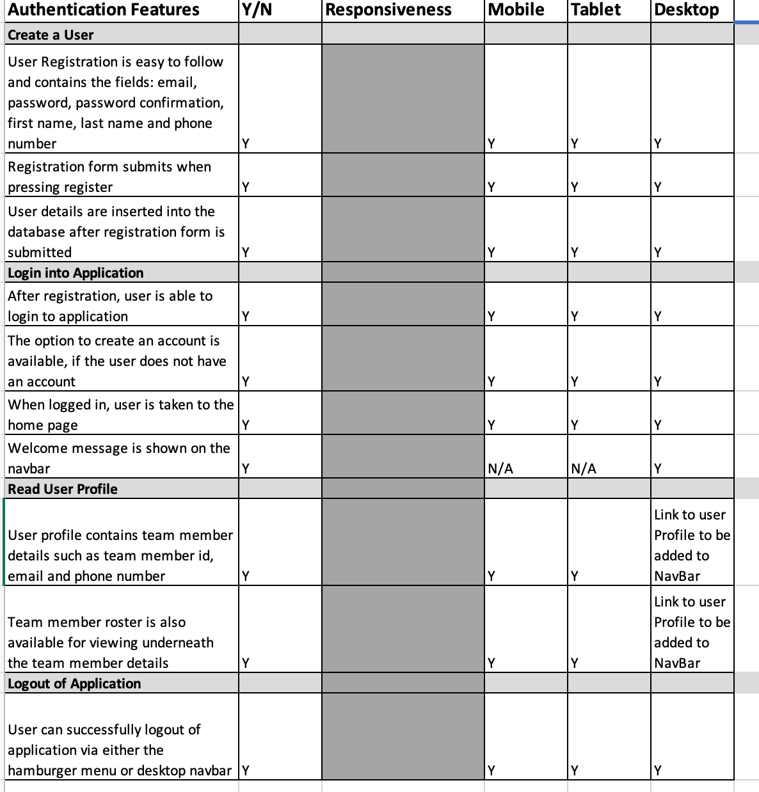

**Demonstration of Testing:**
Link to the demonstration of user authentication testing can be found [here](https://streamable.com/rkteex)

### Event Feature

**Create Event:**
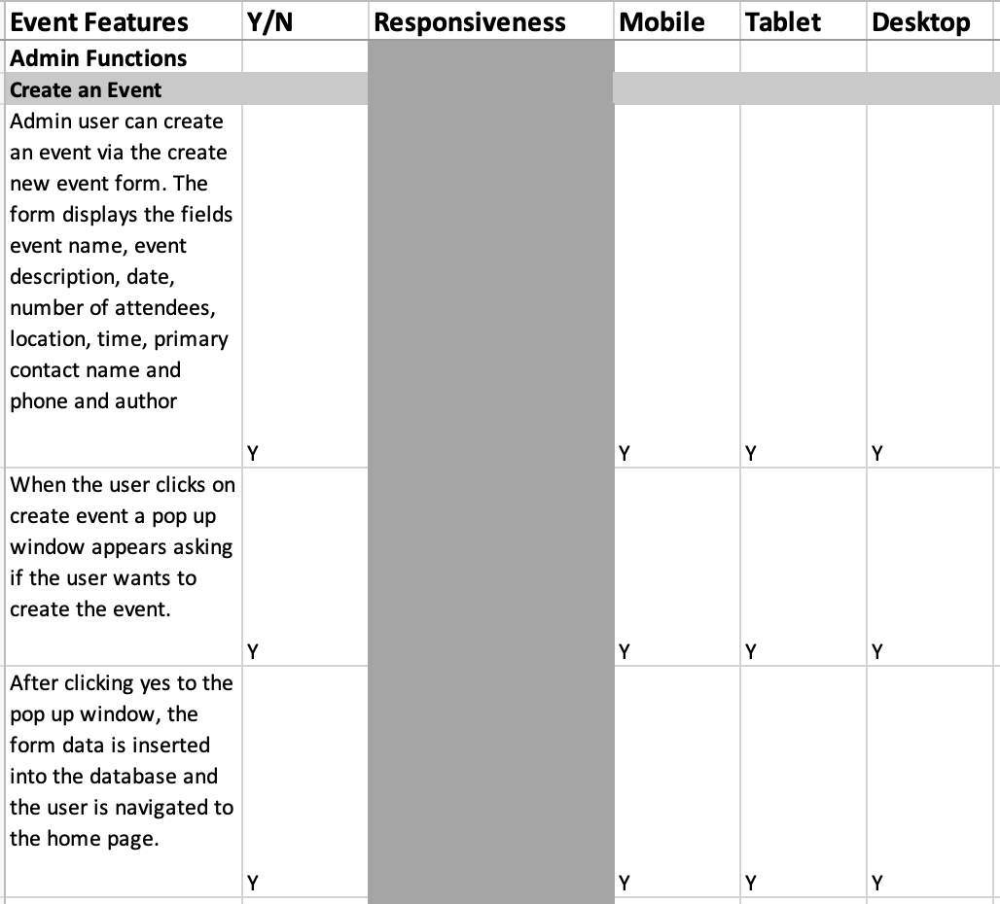

**Read Event:** 
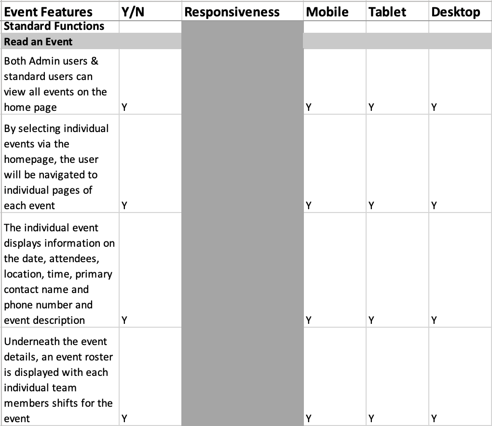

**Edit Event:** 
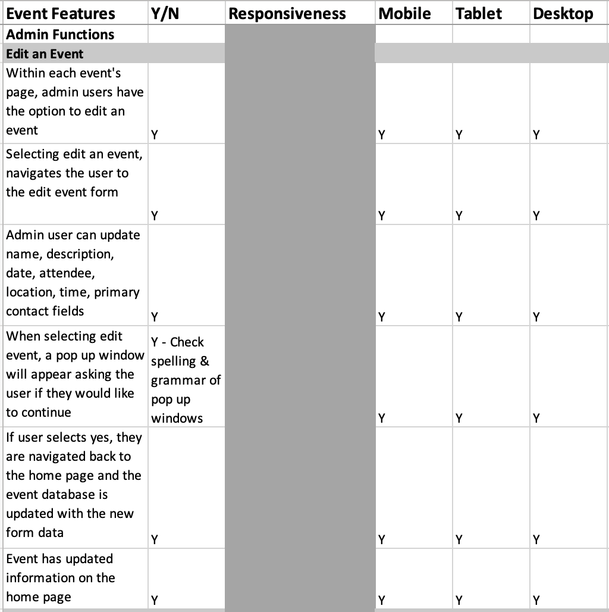

**Delete Event:**
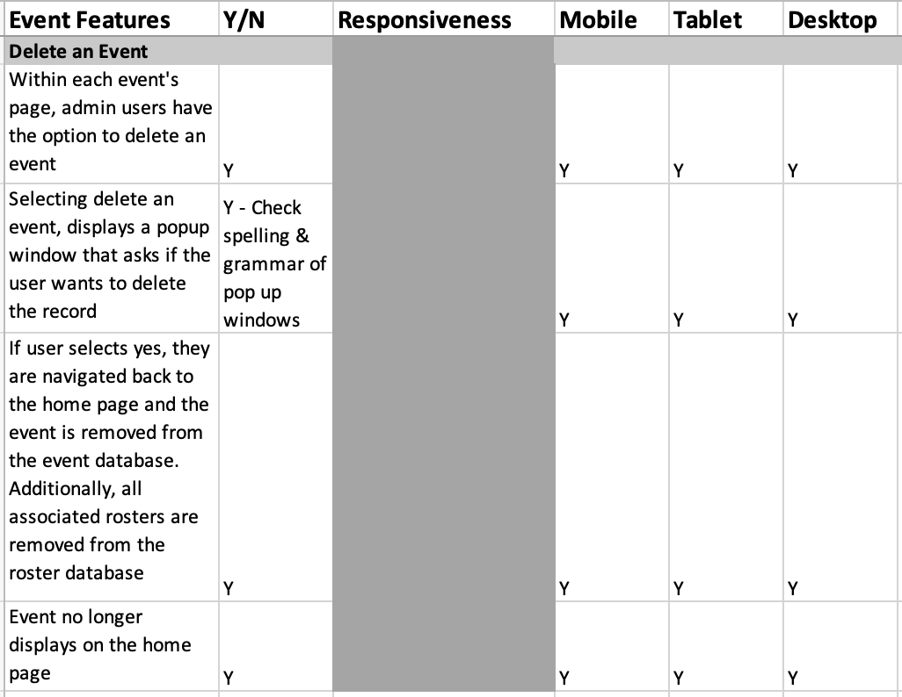

**Demonstration of Testing:**
Link to the demonstration of Event testing can be found [here](https://streamable.com/3936yk) 

### Roster Feature

**Create Roster:**
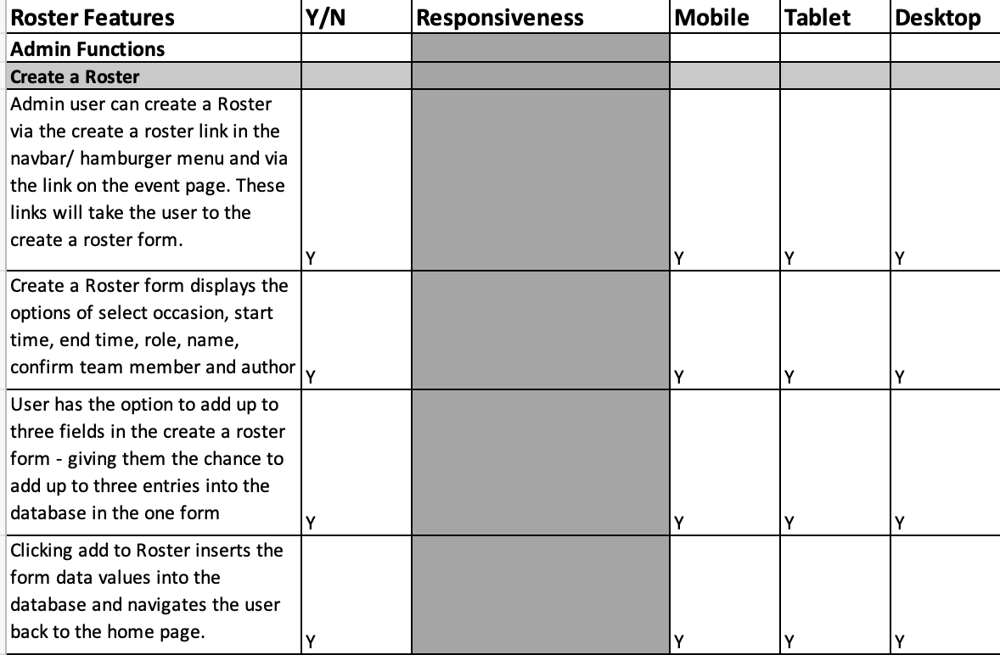

**Read Roster:**
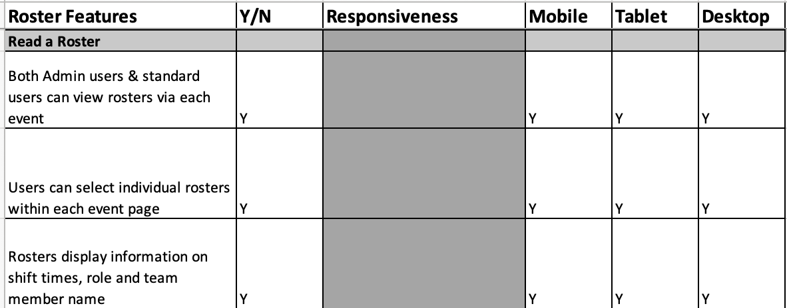

**Edit Roster:**
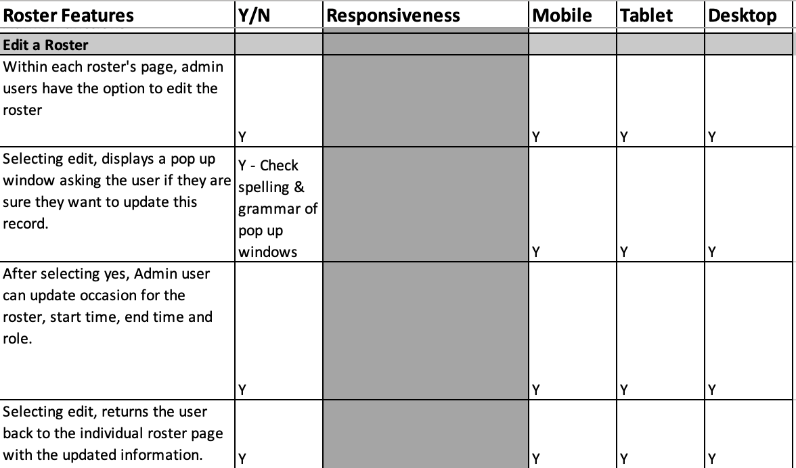

**Delete Roster:**
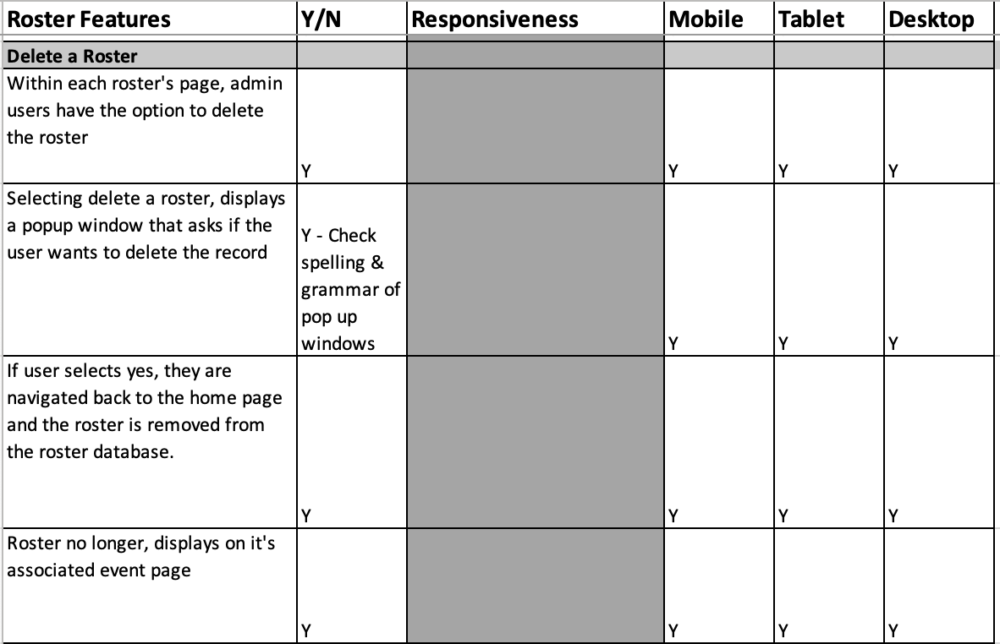

**Demonstration of Testing:**
Link to the demonstration of Roster testing can be found [here](https://streamable.com/i924k5)

### Event Schedule Feature
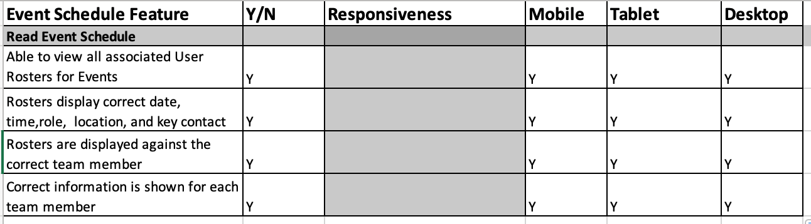

**Demonstration of Testing:**
Link to the demonstration of Event Schedule testing can be found [here](https://streamable.com/x3xid8)